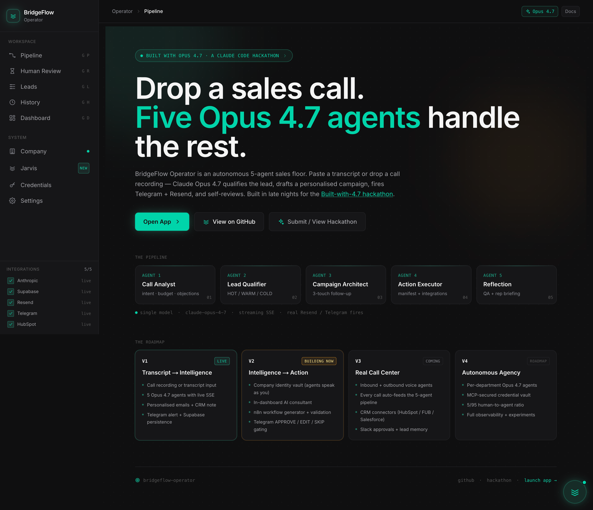
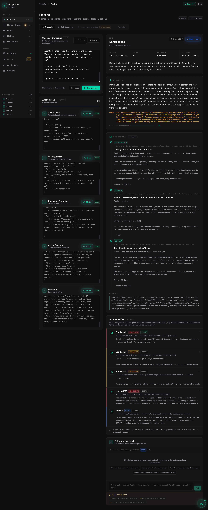
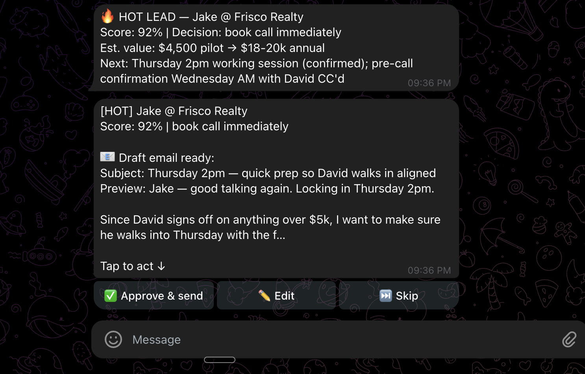
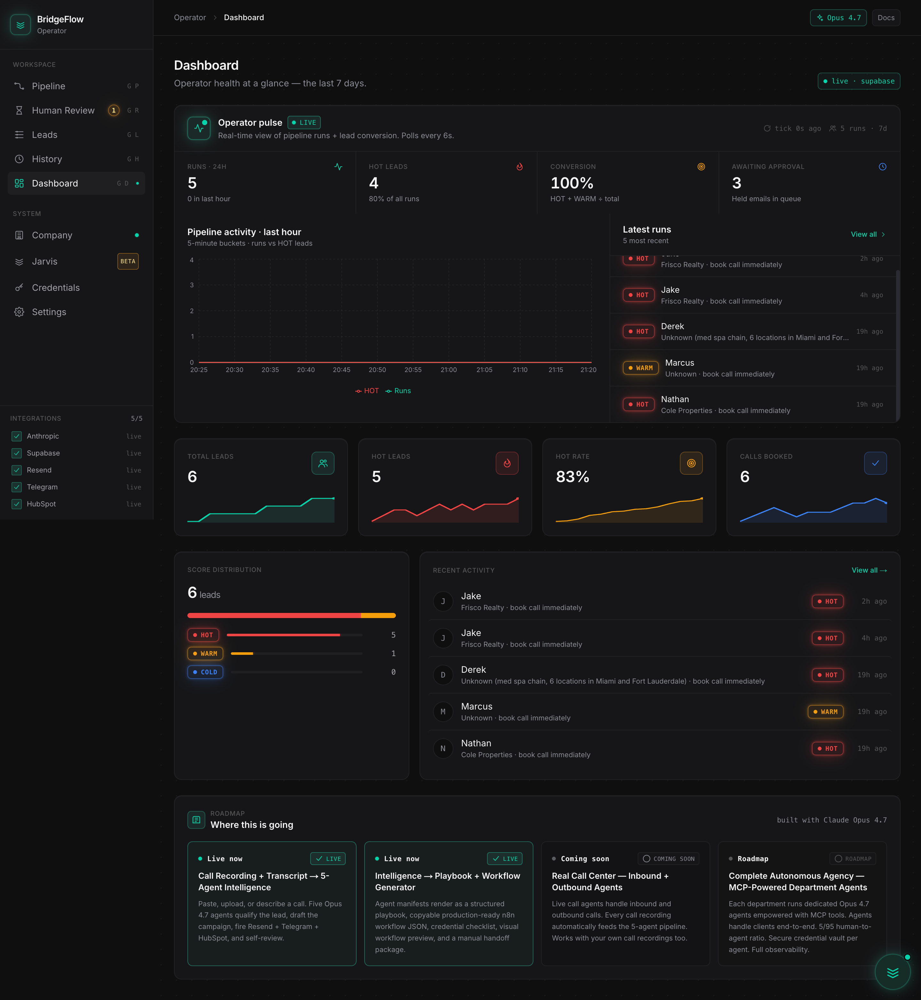
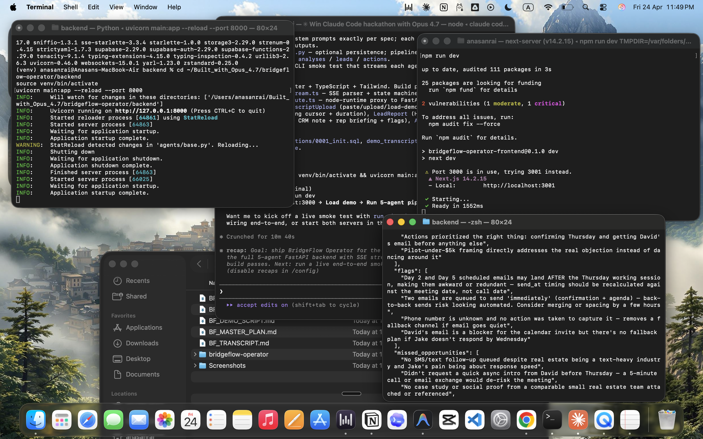

<div align="center">

# BridgeFlow Operator

**An autonomous 5-agent sales floor — every agent is Claude Opus 4.7.**

Drop a sales call. Five Opus 4.7 agents qualify the lead, draft a personalized
follow-up campaign, fire real Telegram + Resend + HubSpot actions, generate an
importable n8n workflow, and self-review — in 90 seconds.

[](https://operator.bridgeflow.agency)
[](https://cerebralvalley.ai/e/built-with-4-7-hackathon)
[](#license)



</div>

---

## 💸 Hackathon credit usage

Anthropic gave every team **$500 in Claude API credits** for the hackathon.
Here's exactly what we spent — straight from the Anthropic console:

| API Key | Period | Cost | Share of $500 |
| --- | --- | ---: | ---: |
| **Claude-Code** (Opus 4.7 + Haiku 4.5) | Apr 21 → Apr 26 (5 days) | **$425.21** | **85.04%** |

```
$0 ─────────────────────────────────────────────████ $500
                                                ▲
                                            $425.21
                                            85% spent
                                            $74.79 remaining
```

That's a real product across **5 streaming agents × hundreds of test runs**,
plus the workflow generator's self-correcting loop, plus Jarvis (Opus voice
assistant + Haiku vision), plus every prompt iteration shown in this repo's
git history. Receipts, not vibes.

---

## What it does

You drop in a sales call. **90 seconds later**:

- The lead is **scored** HOT / WARM / COLD with a confidence %
- A **3-touch email sequence** is drafted referencing what the prospect actually said
- A **CRM note** lands in HubSpot, in your rep's voice
- A **Telegram message** asks you to APPROVE / EDIT / SKIP before anything sends
- An importable **n8n workflow JSON** is generated for your team to deploy
- A **rep briefing** explains exactly why each decision was made

Five Opus 4.7 agents do this. One model. Five personas. Zero fine-tuning.



---

## The Pipeline

```
INPUT  ─►  Sales call recording (MP3 / WAV / M4A)  or  raw transcript
                                  │
                                  ▼
              ┌──────────────────────────────────────┐
              │  GROQ WHISPER · whisper-large-v3-turbo│
              │  free · 216× real-time                │
              └──────────────────┬───────────────────┘
                                 │
                                 ▼
   ◆  AGENT 01  ─  CALL ANALYST                              #00D4AA
       claude-opus-4-7
       intent · budget · timeline · objections · sentiment ·
       BANT signals · key quotes · follow-up hooks · red flags
                                 │
                                 ▼
   ◈  AGENT 02  ─  LEAD QUALIFIER                            #22c55e
       claude-opus-4-7
       HOT / WARM / COLD  +  confidence %
       book_call · nurture_sequence · single_followup · disqualify
                                 │
                                 ▼
   ◉  AGENT 03  ─  CAMPAIGN ARCHITECT                        #a78bfa
       claude-opus-4-7
       3-touch email sequence (immediate · day 2 · day 5)
       CRM note in your agent's voice
       Uses Company Identity vault for tone, pricing, objections
                                 │
                                 ▼
   ◍  AGENT 04  ─  ACTION EXECUTOR                           #f59e0b
       claude-opus-4-7
       action manifest · holds emails for Telegram approval
       HubSpot upsert (search-by-email, no duplicates)
                                 │
                                 ▼
   ◎  AGENT 05  ─  REFLECTION                                #3b82f6
       claude-opus-4-7
       reads every prior agent  ·  catches placeholders + contradictions
       writes plain-English rep briefing
       scores pipeline confidence 0-100
                                 │
                                 ▼
OUTPUT ─►  qualified lead + emails + CRM note + n8n workflow JSON
           + Telegram approval prompt + HubSpot deal + Supabase row
```

The whole thing streams over **Server-Sent Events** so you watch each agent
think in real time. No request lives longer than its meaningful payload.

---

## Why Opus 4.7

Every agent runs `claude-opus-4-7`. We benchmarked Sonnet 4.6 first.

| | Sonnet 4.6 | **Opus 4.7** |
| --- | --- | --- |
| Holds JSON contract across 5 sequential agents | sometimes | **every run** |
| Hallucinated prospect emails | yes | **no** |
| Reflection caught its own upstream mistakes | rarely | **reliably** |
| Self-correcting workflow loop fixes blockers | inconsistent | **deterministic** |

The Reflection agent specifically depends on Opus's ability to read its own
upstream agents' outputs and catch failures — placeholder `[link]` text,
contradictory decisions, missing context. Sonnet missed those almost every
run. Opus catches them and triggers the self-correcting loop in the workflow
generator.

**One model. Five personas. Zero fine-tuning.**

---

## Live integrations

5 production integrations wired end-to-end (each visible in the sidebar):

| | Service | What fires | Status |
| --- | --- | --- | --- |
| 🟢 | **Anthropic** | All 5 agents · Jarvis · workflow generator | live |
| 🟢 | **Supabase** | Postgres · 8 tables · pipeline runs persisted | live |
| 🟢 | **Resend** | `hello@bridgeflow.agency` outbound emails | live |
| 🟢 | **Telegram** | Inline-keyboard APPROVE / EDIT / SKIP | live |
| 🟢 | **HubSpot** | Contact + Deal upsert (search-by-email) | live |
| 🟢 | **Groq** | Whisper transcription, free tier | live |
| 🟢 | **ElevenLabs** | Jarvis voice · sentence-streaming TTS | live |



---

## What's live (V1 + V2)

- ✅ Transcript paste **or** audio file upload (MP3 / WAV / M4A)
- ✅ Groq Whisper transcription — free, 216× real-time
- ✅ 5 Opus 4.7 agents with live SSE streaming
- ✅ HOT / WARM / COLD scoring with confidence %
- ✅ **BANT panel** — Budget · Authority · Need · Timeline derived per lead
- ✅ 3-touch personalized email sequence
- ✅ CRM note in your agent's voice
- ✅ Telegram **APPROVE / EDIT / SKIP** with inline keyboard + webhook
- ✅ Resend email delivery
- ✅ HubSpot contact + deal creation (no duplicates)
- ✅ Supabase persistence (calls · analyses · leads · actions · pipeline_runs · pending_approvals · workflow_drafts · company_profiles)
- ✅ Pipeline run history with full transcript preview
- ✅ Leads CRM (filter, edit, archive, hard delete)
- ✅ **Company Identity vault** — agents speak as YOUR company
- ✅ **Jarvis AI consultant** — voice + text, observation-first greetings, Haiku 4.5 vision
- ✅ **Lead memory** — prior call history injected on repeat prospects
- ✅ **n8n workflow generator** — playbook + JSON + credential checklist + validation + self-correcting loop
- ✅ **Always-on voice mode** — wake word + barge-in, ElevenLabs streaming TTS



---

## Roadmap

> **Architect from V5. Build from V1.**

Every feature was designed with the V5 multi-tenant platform in mind, then
stripped to its V1 implementation. V3 / V4 / V5 appear as locked surfaces
inside the app at [`/roadmap`](https://operator.bridgeflow.agency/roadmap).

### V3 — Call Center *(coming)*
- VAPI / Twilio webhook → auto-pipeline on call end
- Inbound + outbound voice agents
- Real-time agent whisper to the rep mid-conversation
- More CRM connectors: Follow Up Boss · Salesforce
- Slack approvals as a peer to Telegram

### V4 — Agency *(6 months out)*
- Per-department autonomous agents (Sales, Support, Legal, Finance)
- MCP-secured credential vault — no plaintext envs
- Cross-agent handoffs (Sales → Onboarding → CSM)
- Weekly P&L generated by the agency itself
- 5/95 human-to-agent ratio

### V5 — Platform *($1M ARR target)*
- Multi-tenant workspaces with strict data isolation
- White-label deployment for agencies
- Usage-based billing
- Public marketplace for agent personas + workflow templates

---

## Tech stack

| Layer | Technology |
| --- | --- |
| **Frontend** | Next.js 14 App Router · TypeScript · Tailwind CSS |
| **Backend** | Python 3.11 · FastAPI · async Anthropic SDK · SSE streaming |
| **AI (reasoning)** | Claude Opus 4.7 (`claude-opus-4-7`) — all 5 agents + consultant + workflow generator |
| **AI (vision)** | Claude Haiku 4.5 (`claude-haiku-4-5-20251001`) — Jarvis screen-sense |
| **Transcription** | Groq Whisper (`whisper-large-v3-turbo`) |
| **Database** | Supabase (Postgres + REST) |
| **Email** | Resend |
| **Notifications** | Telegram Bot API (inline keyboards + webhook) |
| **CRM** | HubSpot Private App API |
| **TTS** | ElevenLabs Flash v2.5 |
| **Frontend hosting** | Vercel |
| **Backend hosting** | Railway |
| **Domain** | `operator.bridgeflow.agency` |

---

## Setup

### Prerequisites

- Python 3.11+
- Node.js 18+
- API accounts: Anthropic, Supabase, Resend, Telegram, Groq (HubSpot + ElevenLabs optional)

### 1. Clone

```bash
git clone https://github.com/anasanrai/bridgeflow-operator
cd bridgeflow-operator
```

### 2. Backend

```bash
cd backend
python3 -m venv venv
source venv/bin/activate
pip install -r requirements.txt
cp .env.example .env
# Fill in your API keys
uvicorn main:app --reload --port 8000
```

### 3. Supabase migrations

Open the Supabase SQL Editor and run, in order:

```
supabase/migrations/0001_init.sql
supabase/migrations/0002_disable_rls_for_demo.sql
supabase/migrations/0003_v2_tables.sql
supabase/migrations/0004_v2_qa_pass.sql
```

### 4. Frontend

```bash
cd frontend
npm install
cp .env.example .env.local
# Set NEXT_PUBLIC_API_URL=http://localhost:8000
npm run dev
```

Open `http://localhost:3000`.

---

## Environment Variables

```env
# Required
ANTHROPIC_API_KEY=sk-ant-...
SUPABASE_URL=https://xxx.supabase.co
SUPABASE_KEY=eyJ...

# Integrations (each unlocks a feature in the UI)
GROQ_API_KEY=gsk_...               # Audio transcription
RESEND_API_KEY=re_...               # Email delivery
RESEND_FROM=hello@yourdomain.com
TELEGRAM_BOT_TOKEN=123:ABC-...      # Approval notifications + inline keyboard
TELEGRAM_CHAT_ID=6650...            # Your chat ID
HUBSPOT_TOKEN=pat-eu1-...           # CRM contact + deal sync
HUBSPOT_PORTAL_ID=12345678          # For deep-link "Open in HubSpot"
HUBSPOT_REGION=eu1                  # eu1 / na1
ELEVENLABS_API_KEY=...              # Optional — Jarvis voice assistant
ELEVENLABS_VOICE_ID=onwK4e9ZLuTAKqWW03F9
ELEVENLABS_MODEL_ID=eleven_flash_v2_5
```

---

## SSE Event Schema

`POST /analyze` streams Server-Sent Events:

```
event: pipeline_start
data: {"call_id": "uuid", "timestamp": "..."}

event: agent_start
data: {"agent": "call_analyst", "index": 0}

event: agent_delta
data: {"agent": "call_analyst", "delta": "...streaming token..."}

event: agent_complete
data: {"agent": "call_analyst", "output": {...}, "duration_ms": 14200}

event: hubspot_sync
data: {"contact_id": "...", "deal_id": "...", "contact_url": "..."}

event: pipeline_complete
data: {"call_id": "...", "score": "hot", "confidence": 88, "actions": [...]}

event: error
data: {"message": "...", "agent": "..."}
```

The same pattern is used for `/workflow-draft`, `/workflow-refine`, and
`/jarvis` — Railway's edge proxy never sees a 60-second idle.

---

## The story

We started this two days before the hackathon deadline.

The first idea was **FlowForge** — a generic AI workflow builder.
*"Describe your automation, get n8n JSON."*
Already exists in five different forms. Wouldn't stand out.

So we asked the better question: where have we *seen* automation actually
move money? The answer was sales follow-up. We've built workflow automation
for real estate teams as contract work — the pattern shows up every time.
Inbound leads come in fast, follow-up is manual, things slip, and the
slippage is invisible until someone audits the CRM.

We didn't have lived experience as the operator. But we'd seen the gap from
the build side often enough to know it was real, big, and unsolved by the
generic workflow tools. With Opus 4.7's reasoning across multiple agents,
we could finally close it end-to-end — not just "draft an email," but
*qualify, decide, draft, fire, and self-review* in one pass.

So we threw away FlowForge and built **BridgeFlow Operator**.

Two days later, this is what shipped: upload a call → 90 seconds → qualified
lead, personalized emails referencing what the prospect actually said, CRM
note in the rep's voice, HubSpot deal created, and a Telegram message
asking for approval before anything sends.

It's a first version of a product we'd actually ship to the agencies we
already know. That's the bet.



---

## Built with

- [**Claude Code**](https://claude.com/claude-code) — entire codebase, every line
- [**Claude Opus 4.7**](https://www.anthropic.com/claude) — all 5 agents + consultant + workflow generator
- [**Claude Haiku 4.5**](https://www.anthropic.com/claude) — Jarvis screen-sense vision
- [**Groq**](https://groq.com) — Whisper transcription
- [**Supabase**](https://supabase.com) — Postgres + REST
- [**Resend**](https://resend.com) — email delivery
- [**HubSpot**](https://www.hubspot.com) — CRM
- [**Telegram**](https://core.telegram.org/bots/api) — approval notifications
- [**ElevenLabs**](https://elevenlabs.io) — voice assistant TTS
- [**Vercel**](https://vercel.com) — frontend hosting
- [**Railway**](https://railway.app) — backend hosting

---

## License

**MIT** — every component (backend, frontend, prompts, schemas, this README)
is open source per the hackathon rules.

---

<div align="center">

**Built in 45 hours for the *Built with Opus 4.7* hackathon.**

**[operator.bridgeflow.agency](https://operator.bridgeflow.agency)** ·
**[GitHub](https://github.com/anasanrai/bridgeflow-operator)** ·
**[Roadmap](https://operator.bridgeflow.agency/roadmap)**

</div>
